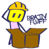

# brainfluff

  
  
An open source physics sandbox created in Godot

# to-do (v0.1)
- [x] Vertex polygon building
- [x] Polygon physics body assignment
- [X] Polygon CSG-type manipulation
- [X] Dotted geometry (pre-commit)
- [ ] Modifiable verticies (translation, deletion)
- [ ] Modifiable polygons (translation, rotation, scaling)
- [ ] RigidBody player controller
- [ ] Grid system
- [x] Editor camera

# to-do (future)
- [ ] Grabbing/interaction
- [ ] Joints (bolt, motor)
- [ ] Connectors (string, rod)
- [ ] Background layer
- [ ] Level saving and loading
